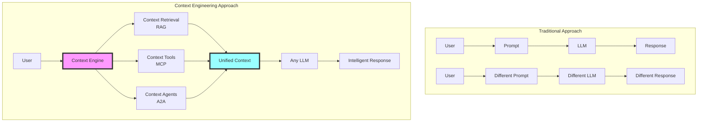

<div align="center">

# Context Engineering

## A Unified Framework for AI Context Management

</div>

<div align="center">

[](https://opensource.org/licenses/MIT)
[](http://makeapullrequest.com)
[](https://github.com/yourusername/context-engineering)

</div>

> **"Context engineering is the delicate art and science of filling the context window with just the right information for the next step."** — [**Andrej Karpathy**](https://x.com/karpathy/status/1937902205765607626)

<div align="center">

```
═══════════════════════════════════════════════════════════════════
                 PROMPT ENGINEERING vs CONTEXT ENGINEERING
═══════════════════════════════════════════════════════════════════

        Prompt Engineering              Context Engineering
              │                                │
              ▼                                ▼
        "What you say"              "Everything else that matters"
     (Single instruction)           (RAG + MCP + A2A + Memory +
                                    Tools + State + Control Flow)
              │                                │
              ▼                                ▼
         One-shot task              Orchestrated intelligence
═══════════════════════════════════════════════════════════════════
```

</div>

## Definition

> **Context is not just the prompt. Context is the complete information ecosystem provided to an AI system at inference time—encompassing retrieval systems, tool protocols, agent networks, memory structures, and control flows that enable complex reasoning and action.**

## Why This Repository Exists

Once you've mastered prompts, the real power comes from engineering the **entire context window**. This repository provides a unified framework that bridges three critical technologies:

- **RAG** (Retrieval-Augmented Generation) - *Knowledge at scale*
- **MCP** (Model Context Protocol) - *Tools and integrations*
- **A2A** (Agent-to-Agent Protocol) - *Collaborative intelligence*

...into a single, cohesive platform for context engineering.

## The Biological Metaphor

We structure context engineering using a biological progression model:

```
┌─────────────────────────────────────────────────────────────────────────┐
│                     CONTEXT ENGINEERING PROGRESSION                      │
├─────────────────────────────────────────────────────────────────────────┤
│                                                                         │
│   🧬 atoms     →    🔗 molecules    →    🦠 cells    →    🫀 organs    →    🧠 systems   │
│      │                  │                  │               │                │        │
│   single            few-shot           memory +         multi-          unified    │
│   prompt            examples            RAG            agent          context     │
│                                                      protocols         engine      │
│                                                                                   │
│   "Tell me"      "Here's how"      "Remember"      "Collaborate"    "Orchestrate"│
│                                                                                   │
└─────────────────────────────────────────────────────────────────────────┘
```

## Quick Visualization



## Core Concepts & Implementation

### 🧬 Level 1: Atoms (Single Prompts)

The foundation - optimizing individual prompts.

```python
# Traditional prompt engineering
response = llm.complete("Write a marketing email for our product")

# Context-aware prompt
response = llm.complete(
    prompt="Write a marketing email",
    context={
        "product": load_product_info(),
        "audience": get_target_demographics(),
        "tone": brand_voice_guidelines
    }
)
```

### 🔗 Level 2: Molecules (Few-Shot Learning)

Combining examples to teach patterns.

```python
# Few-shot with context structure
examples = [
    {"input": "Customer complaint", "output": "Empathetic response"},
    {"input": "Feature request", "output": "Acknowledge and log"},
]

response = engine.complete(
    prompt=user_message,
    examples=examples,
    context_type="customer_service"
)
```

### 🦠 Level 3: Cells (Memory + RAG)

Living systems that remember and retrieve.

```python
# RAG-enhanced context
class ContextCell:
    def __init__(self):
        self.memory = VectorStore()
        self.retriever = HybridRetriever()
    
    def process(self, query):
        # Retrieve relevant context
        docs = self.retriever.search(query)
        history = self.memory.get_relevant(query)
        
        # Generate with full context
        return self.generate(query, docs, history)
```

### 🫀 Level 4: Organs (Multi-Protocol Systems)

Specialized components working together.

```python
# MCP + A2A Integration
class ContextOrgan:
    def __init__(self):
        self.mcp_client = MCPClient()
        self.a2a_network = A2ANetwork()
        self.rag_system = RAGPipeline()
    
    async def process_complex_task(self, task):
        # Gather context from all sources
        knowledge = await self.rag_system.retrieve(task)
        tools = await self.mcp_client.get_relevant_tools(task)
        agents = await self.a2a_network.discover_specialists(task)
        
        # Orchestrate execution
        return await self.orchestrate(task, knowledge, tools, agents)
```

### 🧠 Level 5: Systems (Unified Context Engineering)

Complete intelligent systems with emergent capabilities.

```python
# The Unified Context Engine
class UnifiedContextEngine:
    """The complete context engineering system"""
    
    def __init__(self):
        self.rag = MultiSourceRAG()
        self.mcp = ProtocolBridge()
        self.a2a = AgentMesh()
        self.memory = PersistentMemory()
        self.orchestrator = ContextOrchestrator()
    
    async def query(self, request: str, context: dict = None):
        # Analyze request complexity
        complexity = self.analyze_complexity(request)
        
        # Build appropriate context
        if complexity.needs_retrieval:
            context['knowledge'] = await self.rag.retrieve(request)
        
        if complexity.needs_tools:
            context['tools'] = await self.mcp.prepare_tools(request)
        
        if complexity.needs_agents:
            context['agents'] = await self.a2a.summon_agents(request)
        
        # Execute with full context
        return await self.orchestrator.execute(request, context)
```

## Real Implementation Examples

### Example 1: Customer Support System

```python
# Unified context for customer support
support_engine = UnifiedContextEngine(
    rag_sources=["product_docs", "support_history", "faq"],
    mcp_tools=["ticket_system", "crm", "knowledge_base"],
    a2a_agents=["technical_expert", "billing_specialist", "escalation_manager"]
)

# Single API, complete context
response = await support_engine.query(
    "Customer reporting billing issue with enterprise plan"
)
# Automatically:
# - Retrieves relevant docs and history (RAG)
# - Accesses CRM and billing tools (MCP)  
# - Consults billing specialist if needed (A2A)
```

### Example 2: Research Assistant

```python
# Research with full context orchestration
research_engine = UnifiedContextEngine(
    rag_sources=["arxiv", "pubmed", "internal_docs"],
    mcp_tools=["data_analyzer", "chart_generator", "citation_manager"],
    a2a_agents=["domain_expert", "statistician", "writer"]
)

report = await research_engine.query(
    "Analyze trends in quantum computing applications for drug discovery"
)
```

## Architecture Overview

```
┌─────────────────────────────────────────────────────────────────┐
│                    UNIFIED CONTEXT ENGINE                        │
├─────────────────────────────────────────────────────────────────┤
│                                                                 │
│  ┌─────────────┐  ┌─────────────┐  ┌─────────────┐           │
│  │    RAG      │  │    MCP      │  │    A2A      │           │
│  │             │  │             │  │             │           │
│  │ Knowledge   │  │   Tools     │  │   Agents    │           │
│  │ Retrieval   │  │ Integration │  │ Collaboration│           │
│  └──────┬──────┘  └──────┬──────┘  └──────┬──────┘           │
│         │                 │                 │                   │
│         └─────────────────┴─────────────────┘                   │
│                           │                                     │
│                    ┌──────▼──────┐                             │
│                    │   CONTEXT   │                             │
│                    │ ORCHESTRATOR│                             │
│                    └──────┬──────┘                             │
│                           │                                     │
│                    ┌──────▼──────┐                             │
│                    │   UNIFIED   │                             │
│                    │   CONTEXT   │                             │
│                    └──────┬──────┘                             │
│                           │                                     │
│                    ┌──────▼──────┐                             │
│                    │     LLM     │                             │
│                    │  INTERFACE  │                             │
│                    └─────────────┘                             │
│                                                                 │
└─────────────────────────────────────────────────────────────────┘
```

## Getting Started

### Prerequisites

- Python 3.8+
- Vector database (ChromaDB, Pinecone, or Weaviate)
- API keys for your preferred LLM

### Installation

```bash
# Clone the repository
git clone https://github.com/yourusername/context-engineering.git
cd context-engineering

# Install dependencies
pip install -r requirements.txt

# Configure your environment
cp .env.example .env
# Edit .env with your API keys and configuration
```

### Your First Context-Engineered Application

```python
# examples/quickstart.py
from context_engineering import UnifiedContextEngine

# Initialize with your configuration
engine = UnifiedContextEngine(
    llm="gpt-4",
    rag="hybrid",  # vector + keyword search
    mcp=True,      # enable tool protocol
    a2a=True       # enable agent protocol
)

# Simple query that demonstrates unified context
result = await engine.query(
    "Help me analyze last quarter's sales data and suggest improvements"
)

print(result.response)
print(f"Context used: {result.context_summary}")
print(f"Tokens: {result.token_count}")
```

## Project Structure

```
context-engineering/
├── 📚 docs/                    # Comprehensive documentation
│   ├── 01_foundations/         # Core concepts and theory
│   ├── 02_tutorials/           # Step-by-step guides
│   ├── 03_patterns/            # Context patterns catalog
│   └── 04_api_reference/       # API documentation
│
├── 🧬 src/                     # Source code
│   ├── core/                   # Core engine implementation
│   ├── rag/                    # RAG subsystem
│   ├── mcp/                    # MCP protocol implementation
│   ├── a2a/                    # A2A protocol implementation
│   └── orchestrator/           # Context orchestration
│
├── 🔬 examples/                # Working examples
│   ├── 01_atoms/              # Single prompt optimization
│   ├── 02_molecules/          # Few-shot patterns
│   ├── 03_cells/              # RAG integration
│   ├── 04_organs/             # Multi-protocol systems
│   └── 05_systems/            # Complete applications
│
├── 🧪 tests/                   # Test suite
│   ├── unit/                  # Unit tests
│   ├── integration/           # Integration tests
│   └── benchmarks/            # Performance benchmarks
│
└── 🛠️ tools/                   # Development tools
    ├── context_analyzer.py     # Analyze context usage
    ├── token_optimizer.py      # Optimize token usage
    └── protocol_debugger.py    # Debug protocol interactions
```

## Key Features

### 🔄 Protocol Translation
Seamlessly translate between MCP and A2A protocols.

```python
# Automatic protocol bridging
result = await engine.query(
    "Use the calculator tool to help the math expert agent solve this equation"
)
# MCP calculator tool ← → A2A math expert agent
```

### 📊 Context Analytics
Understand and optimize your context usage.

```python
# Analyze context composition
analytics = engine.analyze_last_query()
print(f"RAG contribution: {analytics.rag_percentage}%")
print(f"Tool usage: {analytics.tool_calls}")
print(f"Agent interactions: {analytics.agent_count}")
```

### 🎯 Smart Routing
Automatically route to the most appropriate subsystem.

```python
# The engine decides what's needed
simple_answer = await engine.query("What's 2+2?")  # Direct response
complex_answer = await engine.query(
    "Analyze market trends and predict Q4"  # Uses RAG + Tools + Agents
)
```

## Performance Considerations

### Token Optimization

```python
# Context compression strategies
engine = UnifiedContextEngine(
    compression="semantic",  # Keep semantically important content
    max_context_tokens=8000,
    pruning_strategy="sliding_window"
)
```

### Caching Strategy

```python
# Multi-level caching
engine.configure_cache(
    rag_cache_ttl=3600,      # 1 hour for retrieved docs
    tool_cache_ttl=300,      # 5 min for tool results  
    agent_cache_ttl=1800     # 30 min for agent responses
)
```

## Contributing

We're building the future of context engineering together!

### How to Contribute

1. **🐛 Report Issues**: Found a bug? [Open an issue](https://github.com/yourusername/context-engineering/issues)
2. **💡 Suggest Features**: Have an idea? [Start a discussion](https://github.com/yourusername/context-engineering/discussions)
3. **🔧 Submit PRs**: Ready to code? Check our [contribution guide](CONTRIBUTING.md)

### Priority Areas

- 🔌 Protocol implementations (MCP servers, A2A agents)
- 🚀 Performance optimizations
- 📚 Documentation and tutorials
- 🧪 Test coverage
- 🌍 Multi-language support

## Research Foundation

This project builds on established research:

- **Context Engineering**: [Karpathy, A. (2025)](https://x.com/karpathy/status/1937902205765607626)
- **RAG**: Retrieval-Augmented Generation for Knowledge-Intensive NLP Tasks
- **MCP**: [Anthropic's Model Context Protocol](https://modelcontextprotocol.io)
- **A2A**: [Google's Agent-to-Agent Protocol](https://github.com/google-a2a/A2A)

## Roadmap

### ✅ Phase 1: Foundation (Q1 2025)
- [x] Core architecture
- [x] Basic RAG integration
- [x] MCP client implementation
- [x] A2A protocol support

### 🚧 Phase 2: Integration (Q2 2025)
- [ ] Unified context layer
- [ ] Protocol translation engine
- [ ] Framework adapters (LangChain, CrewAI, AutoGen)
- [ ] Advanced orchestration

### 🔮 Phase 3: Innovation (Q3 2025)
- [ ] Context compression algorithms
- [ ] Intelligent routing system
- [ ] Real-time monitoring
- [ ] Auto-optimization

### 🚀 Phase 4: Scale (Q4 2025)
- [ ] Enterprise features
- [ ] Distributed context management
- [ ] Advanced security
- [ ] Production deployment tools

## Community

- 💬 **[Discord](https://discord.gg/context-engineering)** - Join our community
- 🐦 **[Twitter](https://twitter.com/context_eng)** - Follow for updates
- 📺 **[YouTube](https://youtube.com/@context-engineering)** - Video tutorials
- 📧 **[Newsletter](https://context-engineering.substack.com)** - Monthly updates

## License

MIT License - see [LICENSE](LICENSE) for details.

---

<div align="center">

### Ready to engineer better context?

[⭐ Star this repo](https://github.com/yourusername/context-engineering) · [🍴 Fork it](https://github.com/yourusername/context-engineering/fork) · [🤝 Contribute](CONTRIBUTING.md)

**Together, we're building the future of AI context management**

</div>
