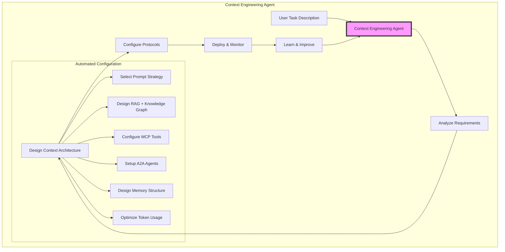
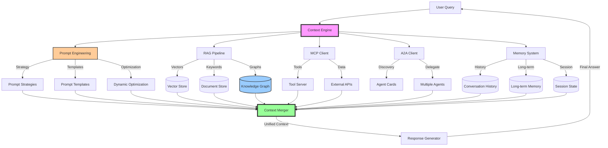

<div align="center">

# Context Engineering

## A Unified Framework for AI Context Management

### **Goal: Building the First Context Engineering Agent**

</div>

<div align="center">

[](https://opensource.org/licenses/MIT)
[](http://makeapullrequest.com)
[](https://github.com/yourusername/context-engineering)

### *Building an AI That Designs Context Architectures for Other AIs*

</div>

> **"Context engineering is the delicate art and science of filling the context window with just the right information for the next step."** — [**Andrej Karpathy**](https://x.com/karpathy/status/1937902205765607626)

## The Mission

We're building a framework that unifies **Prompt Engineering, RAG (with Knowledge Graphs), MCP, A2A protocols, and Memory systems** into a single platform. Our long-term goal is to create an AI agent that can automatically design and optimize context architectures for other AI systems.

<div align="center">

```
═══════════════════════════════════════════════════════════════════════
                 PROMPT ENGINEERING vs CONTEXT ENGINEERING
═══════════════════════════════════════════════════════════════════════

        Prompt Engineering              Context Engineering
              │                                │
              ▼                                ▼
        "What you say"              "Everything that orchestrates
                                         what the model sees"
     (Single instruction)           (Prompts + RAG + MCP + A2A + 
                                    Memory + Knowledge Graphs +
                                    Tools + State + Control Flow)
              │                                │
              ▼                                ▼
         One-shot task              Orchestrated intelligence
═══════════════════════════════════════════════════════════════════════
```

### Our Vision: An AI That Builds AI Context Systems

*The goal is to create an agent where you describe your needs in plain language and it automatically designs the complete context architecture for you.*

</div>

## Definition

> **Context is the complete information ecosystem provided to an AI system at inference time—encompassing prompt strategies, retrieval systems (vectors and knowledge graphs), tool protocols, agent networks, memory structures, and control flows that enable complex reasoning and action.**

### The Ecosystem Approach

Context Engineering treats all components as collaborative agents working together to provide optimal context. Rather than isolated systems, we have:

- **Prompt Engineering**: Not just templates, but an intelligent agent that learns and adapts
- **RAG + Knowledge Graphs**: Not just retrieval, but semantic understanding through relationships
- **MCP**: Not just tools, but dynamic capability discovery
- **A2A**: Not just communication, but orchestrated collaboration
- **Memory**: Not just storage, but active learning and adaptation

This ecosystem approach enables emergent intelligence that surpasses what any component could achieve alone.

### Why Prompt Engineering + Context Engineering?

While prompt engineering focuses on *what* you tell the model, context engineering orchestrates *everything else* the model needs to see. Together, they form a complete system:

- **Prompt Engineering**: The instruction layer - how to ask
- **Context Engineering**: The knowledge layer - what to include

In our framework, prompt engineering itself becomes an agent that:
- Analyzes tasks and selects optimal strategies
- Learns from past interactions
- Collaborates with other agents to craft better prompts
- Adapts based on available context

### The Ecosystem Approach

Each component in our framework acts as a specialized agent:

1. **Prompt Agent**: Optimizes how we communicate with the LLM
2. **RAG Agent**: Manages knowledge retrieval from vectors and graphs
3. **MCP Agent**: Handles tool discovery and execution
4. **A2A Coordinator**: Orchestrates multi-agent collaboration
5. **Memory Agent**: Maintains state and learns from interactions

These agents work together, sharing context and optimizing the overall system performance. This ecosystem approach enables:
- Better context relevance through agent specialization
- Improved efficiency through parallel processing
- Enhanced learning through shared experiences
- Greater flexibility through modular design

## Building the First Context Engineering Agent

### The Goal

Create an AI system that can:

- Select optimal prompting strategies for any task
- Design knowledge retrieval systems with vector stores and knowledge graphs
- Automatically configure RAG, MCP, A2A, and Memory systems
- Optimize token usage and performance
- Learn from usage patterns to improve over time

### Current State vs Future Vision

| **Today: Manual Context Engineering** | **Future: Context Engineering Agent** |
|--------------------------------------|----------------------------------------|
| Hand-crafted prompts | AI-optimized prompting strategies |
| Manual RAG pipeline configuration | Automated pipeline design |
| Separate vector and graph databases | Unified knowledge architecture |
| Hand-coded tool integrations | Automatic tool discovery & setup |
| Trial-and-error optimization | Data-driven optimal configuration |
| Static configurations | Adaptive systems |
| Isolated memory systems | Unified memory architecture |
| Requires deep technical knowledge | Natural language interface |

### Proposed Architecture



## Why This Repository Exists

The AI ecosystem has evolved rapidly, but integration remains fragmented:

- **Prompt Engineering** techniques are scattered across repositories and papers
- **RAG systems** excel at retrieval but operate in isolation
- **MCP (Model Context Protocol)** enables tool use but is limited to single agents
- **A2A (Agent-to-Agent Protocol)** allows agent communication but requires manual orchestration
- **Memory systems** exist but lack standardization and integration
- **Knowledge graphs** are underutilized in context construction
- **Multiple frameworks** exist but don't interoperate

This repository provides a **unified framework** that bridges these technologies.

## Progressive Learning Path

We structure learning using a biological metaphor:

```
foundation → atoms → molecules → cells → organs → systems
     │         │        │         │        │          │
  prompts   single   few-shot   memory   multi-    unified
    101    context   examples   + state  protocol   context
```

## Core Architecture

### Prompt Engineering

Prompt Engineering remains the foundation - the art of crafting effective instructions. In our unified framework, prompts become dynamic and context-aware:

#### Types of Prompts
```python
class PromptEngineering:
    def __init__(self):
        self.templates = PromptTemplateLibrary()
        self.strategies = PromptStrategies()
    
    def craft_prompt(self, task_type, context):
        # Select optimal prompting strategy
        if task_type == "reasoning":
            return self.strategies.chain_of_thought(context)
        elif task_type == "analysis":
            return self.strategies.few_shot(context)
        elif task_type == "creative":
            return self.strategies.role_based(context)
        else:
            return self.strategies.standard(context)
```

#### Prompting Strategies
- **Zero-shot**: Direct instruction without examples
- **Few-shot**: Learning from examples
- **Chain-of-Thought**: Step-by-step reasoning
- **Role-based**: Assuming specific personas
- **Structured**: Using templates and schemas
- **ReAct**: Reasoning and Acting interleaved

#### Integration with Other Systems
```python
# Prompt engineering as an agent in the ecosystem
prompt_agent = PromptEngineeringAgent(
    knowledge_base=rag_system,           # Access to retrieval
    tool_awareness=mcp_client,           # Know available tools
    collaboration=a2a_network,           # Coordinate with other agents
    memory=memory_system                 # Remember effective patterns
)

# Dynamic prompt optimization
optimized_prompt = prompt_agent.optimize(
    base_prompt="Analyze this data",
    context=current_context,
    past_performance=memory.get_prompt_effectiveness()
)
```

### RAG with Knowledge Graphs

Enhanced retrieval combining vector search with knowledge graph traversal:

#### Hybrid RAG Architecture
```python
class HybridRAG:
    def __init__(self):
        self.vector_store = VectorDatabase()      # Semantic search
        self.knowledge_graph = KnowledgeGraph()   # Relationship traversal
        self.keyword_index = KeywordIndex()       # Exact matching
    
    async def retrieve(self, query, max_hops=2):
        # Parallel retrieval from all sources
        results = await asyncio.gather(
            self.vector_store.search(query),
            self.knowledge_graph.traverse(query, max_hops),
            self.keyword_index.search(query)
        )
        
        # Merge and rank results
        return self.merge_and_rank(results)
```

#### Knowledge Graph Integration
```python
class KnowledgeGraph:
    def __init__(self):
        self.graph_db = Neo4jClient()  # Or any graph database
        self.embedder = EmbeddingModel()
    
    def traverse(self, start_entity, query, max_hops=2):
        # Find entities related to query
        entities = self.find_entities(query)
        
        # Traverse relationships
        paths = []
        for entity in entities:
            paths.extend(
                self.graph_db.traverse(
                    start=entity,
                    pattern="(e)-[*1..{max_hops}]-(related)",
                    filters=self.relevance_filter(query)
                )
            )
        
        # Convert paths to context
        return self.paths_to_context(paths)
    
    def add_knowledge(self, fact):
        # Extract entities and relationships
        entities = self.extract_entities(fact)
        relationships = self.extract_relationships(fact)
        
        # Add to graph
        self.graph_db.merge_entities(entities)
        self.graph_db.create_relationships(relationships)
```

### Memory Systems

Memory is crucial for maintaining context across interactions. We implement three types:

#### Short-term Memory
- **Conversation History**: Recent interactions within a session
- **Working Memory**: Active task state and intermediate results
- **Context Buffer**: Sliding window of recent context

#### Long-term Memory
- **Persistent Knowledge**: User preferences and learned patterns
- **Episodic Memory**: Important past interactions and outcomes
- **Semantic Memory**: Extracted concepts and relationships

#### Memory Operations
```python
class HierarchicalMemory:
    def __init__(self):
        self.short_term = ShortTermMemory(capacity=1000)
        self.long_term = LongTermMemory(vector_store=True)
        self.working = WorkingMemory()
    
    async def remember(self, interaction, importance_score):
        # Always store in short-term
        self.short_term.add(interaction)
        
        # Selectively promote to long-term
        if importance_score > 0.7:
            await self.long_term.store(interaction)
        
        # Update working memory state
        self.working.update(interaction)
    
    async def recall(self, query, context_window=10):
        # Combine all memory sources
        recent = self.short_term.get_last(context_window)
        relevant = await self.long_term.search(query, top_k=5)
        state = self.working.get_state()
        
        return {
            'recent': recent,
            'relevant': relevant,
            'state': state
        }
```

### Why Five Pillars as Collaborative Agents?

Our framework treats each component as an intelligent agent that specializes in its domain:

1. **Prompt Engineering Agent**: Crafts optimal instructions
2. **RAG Agent**: Manages knowledge retrieval from vectors and graphs  
3. **MCP Agent**: Discovers and executes tools
4. **A2A Coordinator**: Orchestrates specialist agents
5. **Memory Agent**: Maintains context and learns

This agent-based architecture enables:
- **Parallel Processing**: Agents work simultaneously
- **Specialization**: Each agent excels at its specific task
- **Collaboration**: Agents share insights and optimize together
- **Scalability**: Easy to add new agent types
- **Learning**: Each agent improves independently

The result is a self-organizing ecosystem where the whole is greater than the sum of its parts.

### The Context Engineering Flow



## Implementation Examples

### Example: All Systems as Collaborative Agents

```python
# Each system acts as a specialized agent for optimal context
class ContextEcosystem:
    def __init__(self):
        # Each component is an agent with specific expertise
        self.prompt_agent = PromptEngineeringAgent()
        self.rag_agent = RetrievalAgent(
            vector_store=True,
            knowledge_graph=True,
            hybrid_search=True
        )
        self.mcp_agent = ToolAgent()
        self.a2a_coordinator = AgentCoordinator()
        self.memory_agent = MemoryAgent()
    
    async def process(self, query: str, user_id: str):
        # Step 1: Prompt agent analyzes and optimizes the query
        optimized_query = await self.prompt_agent.enhance(
            query,
            strategy=self.memory_agent.get_best_strategy(user_id)
        )
        
        # Step 2: All agents work in parallel
        context_components = await asyncio.gather(
            self.rag_agent.retrieve_knowledge(optimized_query),
            self.mcp_agent.prepare_tools(optimized_query),
            self.a2a_coordinator.summon_specialists(optimized_query),
            self.memory_agent.recall_relevant(optimized_query, user_id)
        )
        
        # Step 3: Prompt agent crafts the final prompt with full context
        final_prompt = self.prompt_agent.integrate_context(
            base_query=optimized_query,
            knowledge=context_components[0],
            tools=context_components[1],
            agents=context_components[2],
            memories=context_components[3]
        )
        
        return final_prompt
```

### Example: Customer Support with Memory

```python
# Memory-enhanced customer support system
support_engine = UnifiedContextEngine(
    prompt_strategies=["few_shot", "chain_of_thought", "role_based"],
    rag_sources=["product_docs", "support_tickets"],
    rag_knowledge_graph=True,  # Enable graph traversal
    mcp_tools=["crm_api", "ticket_system"],
    a2a_agents=["technical_expert", "billing_specialist"],
    memory_config={
        "short_term_capacity": 50,  # Last 50 interactions
        "long_term_storage": "pinecone",  # Vector DB for history
        "user_profiles": True  # Remember user preferences
    }
)

# First interaction
result1 = await support_engine.query(
    "My subscription isn't working",
    user_id="user_123"
)
# System remembers: User has subscription issue

# Follow-up interaction (memory kicks in)
result2 = await support_engine.query(
    "I tried restarting but it's still broken",
    user_id="user_123"
)
# System recalls previous context and troubleshooting steps
# No need to re-explain the issue
```

### Level 0: Prompt Engineering Foundation

```python
# Foundation: Effective prompt engineering
prompt_engineer = PromptEngineer()

# Basic prompt
basic = "Summarize this text"

# Enhanced with prompt engineering techniques
enhanced = prompt_engineer.enhance(
    task="summarization",
    techniques=["role_definition", "clear_instructions", "output_format"],
    prompt=basic
)
# Result: "You are an expert summarizer. Provide a concise summary 
# of the following text in 3 bullet points, focusing on key insights:"
```

### Level 1: Basic Context (Atoms)

```python
# Traditional prompt engineering
response = llm.complete("Write a marketing email for our product")

# Context-aware prompt
response = llm.complete(
    prompt="Write a marketing email",
    context={
        "product": load_product_info(),
        "audience": get_target_demographics(),
        "tone": brand_voice_guidelines
    }
)
```

### Level 2: Few-Shot Learning (Molecules)

```python
# Advanced few-shot with prompt engineering
class FewShotOptimizer:
    def __init__(self):
        self.prompt_engineer = PromptEngineer()
        self.example_selector = ExampleSelector()
    
    def create_few_shot_prompt(self, task, context):
        # Select best examples based on task
        examples = self.example_selector.get_relevant_examples(
            task=task,
            n_examples=3,
            diversity_weight=0.3
        )
        
        # Apply prompt engineering techniques
        prompt = self.prompt_engineer.structure_few_shot(
            instruction="You are an expert assistant.",
            examples=examples,
            task=task,
            format_spec="Think step-by-step, then provide your answer.",
            chain_of_thought=True
        )
        
        return prompt
```

### Level 3: Memory + State Management (Cells)

```python
# Memory-enhanced context system
class MemorySystem:
    def __init__(self):
        self.short_term = ConversationMemory()  # Current session
        self.long_term = VectorMemory()         # Persistent knowledge
        self.working = WorkingMemory()          # Active task state
    
    def remember(self, interaction):
        # Store in appropriate memory layer
        self.short_term.add(interaction)
        if self.is_important(interaction):
            self.long_term.store(interaction)
        self.working.update_state(interaction)
    
    def recall(self, query):
        # Retrieve from all memory layers
        recent = self.short_term.get_recent()
        relevant = self.long_term.search(query)
        state = self.working.get_context()
        
        return self.merge_memories(recent, relevant, state)
```

### Level 4: Multi-Protocol Systems (Organs)

```python
# MCP + A2A + Knowledge Graph Integration
class ContextOrgan:
    def __init__(self):
        self.mcp_client = MCPClient()
        self.a2a_network = A2ANetwork()
        self.rag_system = HybridRAGPipeline()
        self.knowledge_graph = KnowledgeGraph()
    
    async def process_complex_task(self, task):
        # Retrieve knowledge from both vectors and graph
        vector_knowledge = await self.rag_system.vector_search(task)
        
        # Traverse knowledge graph for relationships
        graph_knowledge = await self.knowledge_graph.traverse(
            start_concepts=self.extract_entities(task),
            max_depth=3,
            relationship_types=["related_to", "part_of", "causes"]
        )
        
        # Combine knowledge sources
        knowledge = self.merge_knowledge(vector_knowledge, graph_knowledge)
        
        # Get tools and agents
        tools = await self.mcp_client.get_relevant_tools(task)
        agents = await self.a2a_network.discover_specialists(task)
        
        # Orchestrate execution with full context
        return await self.orchestrate(task, knowledge, tools, agents)
```

### Level 5: Unified Context Engineering (Systems)

```python
# The Unified Context Engine with all five pillars
class UnifiedContextEngine:
    """Complete context engineering system"""
    
    def __init__(self):
        self.prompt_engineer = PromptOptimizer()
        self.rag = HybridRAG(vector=True, graph=True)
        self.mcp = ProtocolBridge()
        self.a2a = AgentMesh()
        self.memory = HierarchicalMemory()
        self.orchestrator = ContextOrchestrator()
    
    async def query(self, request: str, user_id: str = None):
        # Step 1: Optimize the prompt
        prompt_strategy = self.prompt_engineer.select_strategy(request)
        optimized_request = self.prompt_engineer.apply(request, prompt_strategy)
        
        # Step 2: Retrieve memories
        memories = await self.memory.recall(optimized_request, user_id)
        context = {'memories': memories, 'prompt_strategy': prompt_strategy}
        
        # Step 3: Analyze request complexity
        complexity = self.analyze_complexity(optimized_request)
        
        # Step 4: Build appropriate context
        if complexity.needs_retrieval:
            # Use both vector search and knowledge graph
            context['knowledge'] = await self.rag.retrieve(
                optimized_request,
                use_graph=complexity.needs_relationships
            )
        
        if complexity.needs_tools:
            context['tools'] = await self.mcp.prepare_tools(optimized_request)
        
        if complexity.needs_agents:
            context['agents'] = await self.a2a.summon_agents(optimized_request)
        
        # Step 5: Create final prompt with full context
        final_prompt = self.prompt_engineer.integrate_context(
            optimized_request, 
            context
        )
        
        # Step 6: Execute with full context
        result = await self.orchestrator.execute(final_prompt, context)
        
        # Step 7: Update memories and learn
        await self.memory.remember(request, result, user_id)
        self.prompt_engineer.learn_from_result(prompt_strategy, result)
        
        return result
```

### Future: The Context Engineering Agent (Concept)

```python
# Conceptual implementation - what we're building toward
class ContextEngineeringAgent:
    """An agent that designs complete context architectures"""
    
    async def design(self, task_description: str):
        # Analyze the task
        requirements = self.analyze_requirements(task_description)
        
        # Design optimal architecture
        architecture = {
            "prompt_strategy": self.select_prompt_strategy(requirements),
            "rag_config": {
                "vector_stores": self.design_vector_architecture(requirements),
                "knowledge_graph": self.design_graph_schema(requirements),
                "hybrid_weights": self.optimize_retrieval_mix(requirements)
            },
            "mcp_tools": self.identify_required_tools(requirements),
            "a2a_agents": self.design_agent_network(requirements),
            "memory_architecture": self.design_memory_system(requirements)
        }
        
        # Generate implementation
        implementation = self.generate_code(architecture)
        
        # Predict performance
        metrics = self.predict_performance(architecture)
        
        return ContextDesign(
            architecture=architecture,
            implementation=implementation,
            estimated_performance=metrics,
            explanation=self.explain_decisions(architecture)
        )

# Example usage (conceptual)
agent = ContextEngineeringAgent()
design = await agent.design("I need a research assistant for medical literature")

print(design.explanation)
# Output:
# "For a medical research assistant, I've designed:
#  - Prompt Strategy: Chain-of-thought with medical role definition
#  - RAG: PubMed vector store + Medical knowledge graph (UMLS-based)
#  - Tools: PubMed API, clinical trial databases, citation manager
#  - Agents: Medical terminology expert, statistics analyst
#  - Memory: Long-term storage of research topics and paper summaries
#  
#  This architecture optimizes for accuracy in medical domain with
#  relationship traversal for discovering related conditions and treatments."
```

## Getting Started

### Prerequisites

- Python 3.8+
- Vector database (ChromaDB, Pinecone, or Weaviate)
- API keys for your preferred LLM

### Installation

```bash
# Clone the repository
git clone https://github.com/yourusername/context-engineering.git
cd context-engineering

# Install dependencies
pip install -r requirements.txt

# Configure your environment
cp .env.example .env
# Edit .env with your API keys and configuration
```

### Your First Context-Engineered Application

```python
from context_engineering import UnifiedContextEngine

# Initialize with your configuration
engine = UnifiedContextEngine(
    llm="gpt-4",
    prompt_engineering=True,    # Enable prompt optimization
    rag="hybrid",              # Vector + knowledge graph search
    mcp=True,                  # Enable tool protocol
    a2a=True,                  # Enable agent protocol
    memory=True                # Enable memory system
)

# Simple query that demonstrates unified context
result = await engine.query(
    "Help me analyze last quarter's sales data and suggest improvements",
    user_id="analyst_1"
)

print(result.response)
print(f"Prompt strategy used: {result.prompt_strategy}")
print(f"Context used: {result.context_summary}")
print(f"Knowledge sources: {result.knowledge_sources}")
print(f"Memories accessed: {result.memory_stats}")
print(f"Tokens: {result.token_count}")
```

## Roadmap

### Phase 1: Foundation (Q1 2025) - COMPLETED
- [x] Core architecture design
- [x] Prompt engineering integration
- [x] Basic RAG with vector search
- [x] Knowledge graph foundation
- [x] MCP client implementation
- [x] A2A protocol support
- [x] Memory system architecture

### Phase 2: Integration (Q2 2025) - IN PROGRESS
- [ ] Unified context layer
- [ ] Protocol translation engine
- [ ] Framework adapters (LangChain, CrewAI, AutoGen)
- [ ] Advanced orchestration
- [ ] Hierarchical memory integration
- [ ] Cross-session persistence
- [ ] Advanced knowledge graph patterns

### Phase 3: Intelligence (Q3 2025)
- [ ] Context pattern recognition
- [ ] Performance analytics
- [ ] Optimization algorithms
- [ ] Learning systems design

### Phase 4: Context Engineering Agent (Q4 2025)
- [ ] Agent architecture implementation
- [ ] Automated configuration system
- [ ] Performance prediction models
- [ ] Beta testing program

### Phase 5: Ecosystem (2026)
- [ ] Community pattern library
- [ ] Integration marketplace
- [ ] Enterprise tools
- [ ] Educational resources

## Contributing

We're building this together. Here's how you can help:

### Priority Areas

1. **Prompt Engineering**
   - Advanced prompting strategies
   - Dynamic prompt optimization
   - Template libraries
   - Strategy effectiveness tracking

2. **Protocol Implementations**
   - MCP server/client components
   - A2A agent examples
   - Protocol adapters

3. **RAG Enhancements**
   - Advanced chunking strategies
   - Vector database integrations
   - Knowledge graph construction
   - Hybrid retrieval optimization

4. **Memory Systems**
   - Efficient storage backends
   - Memory compression algorithms
   - Cross-session persistence
   - User profile management

5. **Integration Work**
   - Framework adapters
   - Example implementations
   - Testing infrastructure

6. **Research & Design**
   - Context effectiveness metrics
   - Pattern recognition algorithms
   - Architecture optimization

### How to Contribute

1. **Report Issues**: Found a bug? [Open an issue](https://github.com/yourusername/context-engineering/issues)
2. **Suggest Features**: Have an idea? [Start a discussion](https://github.com/yourusername/context-engineering/discussions)
3. **Submit PRs**: Ready to code? Check our [contribution guide](CONTRIBUTING.md)

## Project Structure

```
context-engineering/
├── docs/                    # Documentation
│   ├── getting-started/     # Tutorials
│   ├── concepts/           # Core concepts
│   ├── api/                # API reference
│   └── examples/           # Example implementations
│
├── src/                    # Source code
│   ├── core/              # Core engine
│   ├── prompt_engineering/ # Prompt optimization
│   │   ├── strategies/    # CoT, Few-shot, etc.
│   │   ├── templates/     # Prompt templates
│   │   └── optimizer/     # Dynamic optimization
│   ├── rag/               # RAG subsystem
│   │   ├── vector/        # Vector search
│   │   ├── graph/         # Knowledge graphs
│   │   └── hybrid/        # Combined retrieval
│   ├── mcp/               # MCP implementation
│   ├── a2a/               # A2A implementation
│   ├── memory/            # Memory systems
│   │   ├── short_term/    # Session memory
│   │   ├── long_term/     # Persistent memory
│   │   └── working/       # Active state
│   └── orchestrator/      # Context orchestration
│
├── examples/              # Working examples
│   ├── basic/            # Simple examples
│   ├── intermediate/     # Multi-protocol examples
│   └── advanced/         # Complex applications
│
├── tests/                # Test suite
└── tools/                # Development tools
```

## Performance Considerations

### Token Optimization

```python
# Context compression strategies
engine = UnifiedContextEngine(
    compression="semantic",  # Keep semantically important content
    max_context_tokens=8000,
    pruning_strategy="sliding_window",
    prompt_optimization=True  # Minimize prompt tokens
)
```

### Prompt Engineering Optimization

```python
# Track and optimize prompt effectiveness
engine.configure_prompts(
    strategy_selection="adaptive",     # Learn best strategies
    template_caching=True,            # Cache effective templates
    performance_tracking=True,        # Monitor success rates
    token_efficiency=True             # Optimize for fewer tokens
)
```

### Knowledge Graph Performance

```python
# Optimize graph traversal
engine.configure_knowledge_graph(
    max_traversal_depth=3,           # Limit graph exploration
    relationship_caching=True,       # Cache common paths
    entity_embeddings=True,          # Fast similarity search
    batch_traversal=True             # Process multiple queries together
)
```

### Memory Management

```python
# Efficient memory configuration
engine.configure_memory(
    short_term_capacity=100,     # Recent interactions
    long_term_compression=True,  # Compress old memories
    importance_threshold=0.7,    # What to keep long-term
    user_segmentation=True       # Separate memory per user
)
```

### Caching Strategy

```python
# Multi-level caching
engine.configure_cache(
    prompt_cache_ttl=86400,      # 24 hours for prompt templates
    rag_cache_ttl=3600,          # 1 hour for retrieved docs
    graph_cache_ttl=7200,        # 2 hours for graph traversals
    tool_cache_ttl=300,          # 5 min for tool results  
    agent_cache_ttl=1800,        # 30 min for agent responses
    memory_cache_ttl=7200        # 2 hours for memory queries
)
```

## Research Foundation

This project builds on:

- **Context Engineering**: [Karpathy, A. (2025)](https://x.com/karpathy/status/1937902205765607626)
- **Prompt Engineering**: [DAIR AI Guide](https://github.com/dair-ai/Prompt-Engineering-Guide) and best practices
- **RAG**: Retrieval-Augmented Generation research
- **Knowledge Graphs**: Graph-based knowledge representation and retrieval
- **MCP**: [Anthropic's Model Context Protocol](https://modelcontextprotocol.io)
- **A2A**: [Google's Agent-to-Agent Protocol](https://github.com/google-a2a/A2A)
- **Memory Systems**: Episodic and semantic memory architectures for AI

## Community

- **GitHub Discussions**: Technical questions and ideas
- **Issues**: Bug reports and feature requests
- **Contributing**: See [CONTRIBUTING.md](CONTRIBUTING.md)

## License

MIT License - see [LICENSE](LICENSE) for details.

---

<div align="center">

### Join us in building the future of context engineering

[Star this repo](https://github.com/yourusername/context-engineering) · [Fork it](https://github.com/yourusername/context-engineering/fork) · [Contribute](CONTRIBUTING.md)

**The future of AI development is unified context management with intelligent prompt engineering and persistent memory**

</div>
